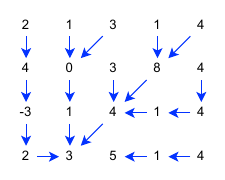
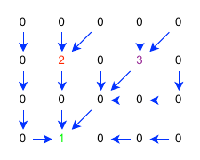

# earthkit-hydro

<p align="center">
  <picture>
    <source srcset="https://github.com/ecmwf/logos/raw/refs/heads/main/logos/earthkit/earthkit-hydro-dark.svg" media="(prefers-color-scheme: dark)">
    
  </picture>
</p>

<p align="center">
  <a href="https://github.com/ecmwf/codex/raw/refs/heads/main/ESEE">
    
  </a>
  <a href="https://github.com/ecmwf/codex/raw/refs/heads/main/Project Maturity">
    
  </a>
  <a href="https://codecov.io/gh/ecmwf/earthkit-hydro">
    
  </a>
  <a href="https://opensource.org/licenses/apache-2-0">
    
  </a>
  <a href="https://github.com/ecmwf/earthkit-hydro/releases">
    
  </a>
</p>

> \[!IMPORTANT\]
> This software is **Emerging** and subject to ECMWF's guidelines on [Software Maturity](https://github.com/ecmwf/codex/raw/refs/heads/main/Project%20Maturity).

**earthkit-hydro** is a Python library for common hydrological functions.

**DISCLAIMER**

> This project is in the **BETA** stage of development. Please be aware that interfaces and functionality may change as the project develops. If this software is to be used in operational systems you are **strongly advised to use a released tag in your system configuration**, and you should be willing to accept incoming changes and bug fixes that require adaptations on your part. ECMWF **does use** this software in operations and abides by the same caveats.

## Installation
Clone source code repository

```
git clone https://github.com/ecmwf/earthkit-hydro.git
cd earthkit-hydro
```

Create and activate conda environment

```
conda create -n hydro python=3.10
conda activate hydro
```

For default installation, run

```
pip install .
```

For a developer installation (includes linting and test libraries), run

```
pip install -e .[dev]
pre-commit install
```

If you only plan to run the tests, instead run

```
pip install -e .[test]
```

## Documentation
Earthkit-hydro can be imported as following:
```
import earthkit.hydro as ekh
```

The package contains different ways of constructing or loading a `RiverNetwork` object. A `RiverNetwork` object is a representation of a river network on a grid.
It can be used to compute basic hydrological functions, such as propagating a scalar along the river network or extract a catchment from the river network.

### Mathematical Details
Given a discretisation of a domain i.e. a set of points $\mathcal{D}=\{ (x_i, y_i)\}_{i=1}^N$, a river network is a directed acyclic graph $\mathcal{R}=(V,E)$ where the vertices $V \subseteq \mathcal{D}$. The out-degree of each vertex is at most 1 i.e. each point in the river network points to at most one downstream location.

For ease of notation, if an edge exists from $(x_i, y_i)$ to $(x_j, y_j)$, we write $i \rightarrow j$.

### Readers

```
ekh.load_river_network(domain="efas", version="5")
```
Loads a precomputed `RiverNetwork`. Current options are
- domain: "efas", version: "5"
- domain: "glofas", version: "4"


```
ekh.create_river_network(path, river_network_format, source)
```
Creates a `RiverNetwork`. Current options are
- river_network_format: "esri_d8", "pcr_d8", "cama" or "precomputed"
- source: An earthkit-data compatable source. See [list](https://earthkit-data.readthedocs.io/en/latest/guide/sources.html)

### Methods

```
ekh.flow_downstream(river_network, field)
```
Calculates the total accumulated flux down a river network.\
$$v_i^{\prime}=v_i+\sum_{j \rightarrow i}~v_j^{\prime}$$



```
ekh.move_downstream(river_network, field)
```
Updates each node with the sum of its upstream nodes.\
$$v_i^{\prime}=\sum_{j \rightarrow i}~v_j$$

```
ekh.move_upstream(river_network, field)
```
Updates each node with its downstream node.\
$$v_i^{\prime} = v_j, ~j ~ \text{s.t.} ~ i \rightarrow j$$

```
ekh.find_catchments(river_network, field)
```
Finds the catchments (all upstream nodes of specified nodes, with overwriting).\
$$v_i^{\prime} = v_j^{\prime}  ~ \text{if} ~  v_j^{\prime} \neq 0 ~ \text{else} ~ v_i, ~j ~ \text{s.t.} ~ i \rightarrow j$$


```
ekh.find_subcatchments(river_network, field)
```
Finds the subcatchments (all upstream nodes of specified nodes, without overwriting).\
$$v_i^{\prime} = v_j^{\prime}  ~ \text{if} ~  (v_j^{\prime} \neq 0 ~ \text{and} ~ v_j = 0) ~ \text{else} ~ v_i, ~j ~ \text{s.t.} ~ i \rightarrow j$$



```
river_network.create_subnetwork(field)
```
Computes the river subnetwork defined by a field mask of the domain.

```
river_network.export(filename)
```
Exports the `RiverNetwork` as a joblib pickle.

## License

```
Copyright 2024, European Centre for Medium Range Weather Forecasts.

Licensed under the Apache License, Version 2.0 (the "License");
you may not use this file except in compliance with the License.
You may obtain a copy of the License at

    http://www.apache.org/licenses/LICENSE-2.0

Unless required by applicable law or agreed to in writing, software
distributed under the License is distributed on an "AS IS" BASIS,
WITHOUT WARRANTIES OR CONDITIONS OF ANY KIND, either express or implied.
See the License for the specific language governing permissions and
limitations under the License.
```
