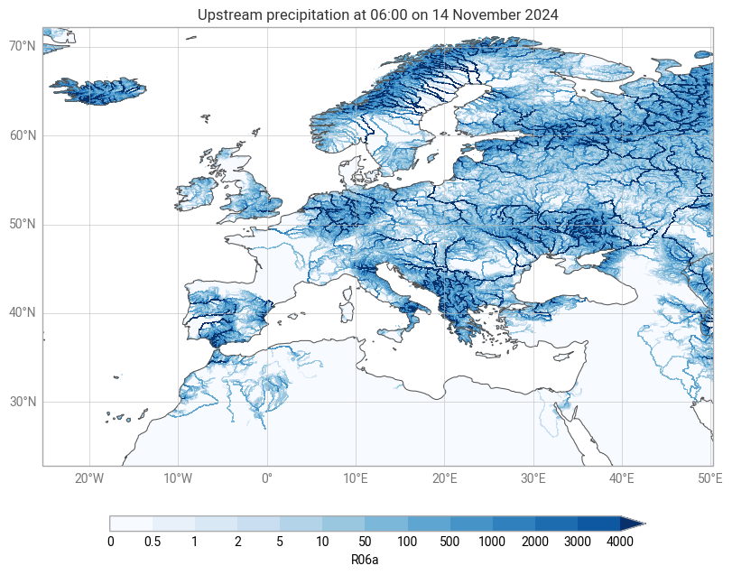

The earthkit ecosystem
======================

Understanding how earthkit-hydro fits into the broader earthkit family helps you leverage the full power of the ecosystem.

What is earthkit?
-----------------

earthkit :cite:`earthkit` is a collection of Python tools for working with earth system data. Each component focuses on a specific domain:

- **earthkit-data:** Data acquisition and access
- **earthkit-hydro:** Hydrological analysis (this package)
- **earthkit-plots:** Visualization and mapping
- **earthkit-transforms:** Data transformations
- **earthkit-meteo:** Meteorological calculations

Why the modular design?
------------------------

Rather than one monolithic package, earthkit components are:

- **Focused:** Each does one thing well
- **Independent:** Use only what you need
- **Compatible:** Designed to work together seamlessly
- **Maintainable:** Smaller codebases, clearer purpose

Integration through xarray
---------------------------

The earthkit components integrate primarily through xarray DataArrays and Datasets. This means:

- Metadata (coordinates, attributes) flows between components
- No custom data structures to learn
- Compatibility with the broader scientific Python ecosystem

Example workflow
----------------

Here's how different earthkit packages work together in a typical hydrological analysis:

.. code-block:: python

    import earthkit.data as ekd
    import earthkit.hydro as ekh
    import earthkit.plots as ekp

    # specify some custom styles
    style = ekp.styles.Style(
        colors="Blues",
        levels=[0, 0.5, 1, 2, 5, 10, 50, 100, 500, 1000, 2000, 3000, 4000],
        extend="max",
    )

    # load data and river network
    network = ekh.river_network.load("efas", "5")
    da = ekd.from_source(
        "sample",
        "R06a.nc",
    ).to_xarray()["R06a"].isel(time=0).load()

    # compute upstream accumulation
    upstream_sum = ekh.upstream.sum(network, da)

    # plot result
    chart = ekp.Map()
    chart.quickplot(upstream_sum, style=style)
    chart.legend(label="{variable_name}")
    chart.title("Upstream precipitation at {time:%H:%M on %-d %B %Y}")
    chart.coastlines()
    chart.gridlines()
    chart.show()

In this example:

1. **earthkit-data** fetches the precipitation data
2. **earthkit-hydro** performs upstream accumulation
3. **earthkit-plots** visualizes the result

The xarray DataArray flows through each step, preserving coordinates and metadata.

Benefits for your workflow
---------------------------

Using earthkit components together provides:

**Consistency:** Similar API design across components

**Efficiency:** No data format conversions between steps

**Completeness:** From data access to visualization in one ecosystem

**Community:** Shared user base and development practices

When to use earthkit-hydro standalone
--------------------------------------

You don't need the full earthkit ecosystem to use earthkit-hydro. The library works perfectly well with:

- Data loaded by other means (``xarray.open_dataset``, ``rasterio``, etc.)
- Visualization using matplotlib, cartopy, or other tools
- Your existing data pipeline

earthkit integration is optional, not required.

.. code-block:: python

    import earthkit.data as ekd
    import earthkit.hydro as ekh
    import earthkit.plots as ekp

    # specify some custom styles
    style = ekp.styles.Style(
        colors="Blues",
        levels=[0, 0.5, 1, 2, 5, 10, 50, 100, 500, 1000, 2000, 3000, 4000],
        extend="max",
    )

    # load data and river network
    network = ekh.river_network.load("efas", "5")
    da = ekd.from_source(
        "sample",
        "R06a.nc",
    )[0].to_xarray()

    # compute upstream accumulation
    upstream_sum = ekh.upstream.sum(network, da)

    # plot result
    chart = ekp.Map()
    chart.quickplot(upstream_sum, style=style)
    chart.legend(label="{variable_name}")
    chart.title("Upstream precipitation at {time:%H:%M on %-d %B %Y}")
    chart.coastlines()
    chart.gridlines()
    chart.show()

