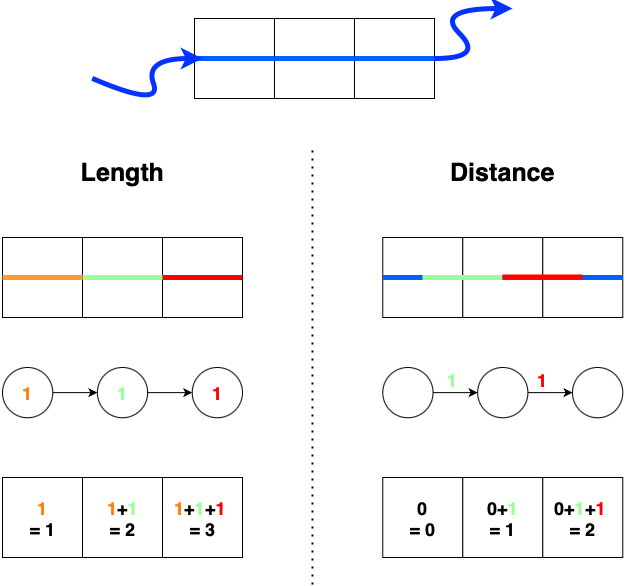

Distance and length calculations
================================

In earthkit-hydro, a distinction is made between distance and length calculations. Although often conflated, they represent different quantities.

Lengths are *node properties* — the extent of a river within each grid cell. There is one length per cell, even at confluences or bifurcations.
Distances are *edge properties* — the cost of traversing from one cell to another. They can differ for each branch at a confluence or bifurcation.

Even in simple networks without confluences, the two are not equivalent. In the figure above, the highlighted segment has a length of 3 but a distance of only 2.

Maximum and minimum paths
-------------------------

River networks typically have many paths between two points. You can compute either the shortest or longest path:

.. code-block:: python

    import earthkit.hydro as ekh
    import numpy as np

    network = ekh.river_network.load("efas", "5")
    locations = {
        "station1": (45.0, 10.0),
        "station2": (46.0, 11.0),
    }

    # Lengths take node-level information
    node_field = np.random.rand(network.n_nodes)
    max_length = ekh.length.max(network, locations, node_field)
    min_length = ekh.length.min(network, locations, node_field)

    # Distances take edge-level information
    edge_field = np.random.rand(network.n_edges)
    max_distance = ekh.distance.max(network, locations, edge_field)
    min_distance = ekh.distance.min(network, locations, edge_field)

Directed and undirected calculations
-------------------------------------

By default, distances and lengths are calculated downstream only. This can be changed with the ``upstream`` and ``downstream`` arguments:

.. code-block:: python

    min_length_upstream = ekh.length.min(network, locations, node_field, upstream=True, downstream=False)
    min_length_downstream = ekh.length.min(network, locations, node_field, upstream=False, downstream=True)
    min_length_undirected = ekh.length.min(network, locations, node_field, upstream=True, downstream=True)

Shorthand functions
-------------------

earthkit-hydro provides convenience functions for calculating distances from sources or to sinks:

.. code-block:: python

    ekh.length.to_sink(network, node_field, path="shortest")
    ekh.length.to_source(network, node_field, path="shortest")
    ekh.distance.to_sink(network, edge_field, path="shortest")
    ekh.distance.to_source(network, edge_field, path="shortest")

Longest path versions are available with ``path="longest"``.

See also
--------

- :doc:`../concepts/distance_vs_length_concepts` — Full conceptual explanation
- :doc:`../tutorials/distance_length` — Tutorial walkthrough
- :doc:`../autodocs/earthkit.hydro.distance` — Distance API reference
- :doc:`../autodocs/earthkit.hydro.length` — Length API reference
