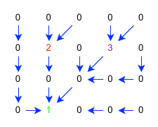

Catchment delineation
=====================

A common task in hydrology is identifying the catchment area for a given point in a river network.
Catchment delineation determines the area that drains into a specific outlet point.

In earthkit-hydro, you specify start locations and label all nodes flowing towards those locations.
If start locations belong to the same catchment, the node furthest downstream takes priority and overwrites any upstream start locations.

.. raw:: html

    

.. code-block:: python

    import earthkit.hydro as ekh

    network = ekh.river_network.load("efas", "5")
    labelled_field = ekh.catchments.find(network, locations)

Subcatchments
-------------

Subcatchments can be found by setting ``overwrite=False``, which preserves all subcatchment boundaries rather than letting downstream outlets overwrite upstream ones.

.. code-block:: python

    labelled_field = ekh.catchments.find(
        network,
        locations,
        overwrite=False
    )

.. raw:: html

    

See also
--------

- :doc:`../tutorials/finding_catchments` — Tutorial walkthrough
- :doc:`../explanation/catchment_concepts` — Catchment concepts explained
- :doc:`specify_locations` — How to specify outlet locations
- :doc:`compute_catchment_statistics` — Compute statistics over catchments
- :doc:`../autodocs/earthkit.hydro.catchments` — API reference
