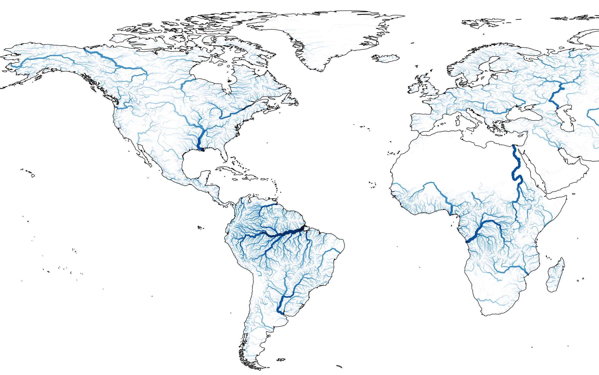

earthkit-hydro
==============

.. important::

    This software is **Emerging** and subject to ECMWF's guidelines on `Software Maturity <https://github.com/ecmwf/codex/raw/refs/heads/main/Project%20Maturity>`_.

**earthkit-hydro** is a Python library for common hydrological functions. It is the hydrological component of earthkit :cite:`earthkit`.

Main Features
-------------

.. raw:: html

   

.. https://agupubs.onlinelibrary.wiley.com/cms/asset/e10b31b2-7a5c-498d-bb27-49966867e6a8/wrcr70124-fig-0002-m.jpg

   *Adapted from:* :cite:`doc_figure`

.. raw:: html

   

- Catchment delineation
- Catchment-based statistics
- Directional flow-based accumulations
- River network distance calculations
- Upstream/downstream field propagation
- Bifurcation handling
- Custom weighting and decay support

.. raw:: html

    

- Support for PCRaster, CaMa-Flood, HydroSHEDS and MERIT-Hydro river network formats
- Compatible with major array-backends: xarray, numpy, cupy, torch, jax and tensorflow
- GPU support
- Differentiable operations suitable for machine learning

.. raw:: html

    

Support
-------
Have a feature request or found a bug? Feel free to open an
`issue <https://github.com/ecmwf/earthkit-hydro/issues/new/choose>`_.

Documentation
-------------
.. toctree::
   :maxdepth: 2
   :titlesonly:

   autodocs/earthkit.hydro
   notebook
   references
