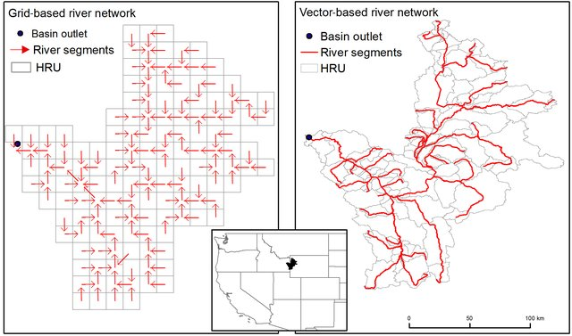

Raster and vector networks
==========================

earthkit-hydro supports both raster (gridded) and vector river networks. These network types have slightly different characteristics which necessitate some clarification.

.. raw:: html

   

   *From:* :cite:`rastervector`

.. raw:: html

   

Raster networks
---------------

Raster networks are the most common type of river network in earthkit-hydro. They are represented as a grid where each cell corresponds to a specific location in the river network.
With these type of networks, it is often most natural to conduct river network operations directly on this grid.

.. code-block:: python

    import earthkit.hydro as ekh

    # Load a raster river network
    network = ekh.river_network.load("efas", "5")

    field = np.ones(network.shape) # field on the river network grid

    output = ekh.upstream.sum(network, field) # output on same grid

Vector networks
---------------

In vector networks, each river segment is represented as a node, and the network is defined by the connections between these nodes.

.. code-block:: python

    # vector field (1D) defined on the nodes of the river network
    field = np.ones(network.n_nodes)

    # output field is also 1D, defined on the nodes of the river network
    output = ekh.upstream.sum(network, field)

Automatic detection
-------------------
Raster networks can also be used as if they were vector networks, since internally the raster network is represented as a vector network.
To allow users to work with both types of networks seamlessly, earthkit-hydro automatically detects which representation to use based on the input data shape.

The last dimensions of the input data are used to determine the type of network:

- If the last two dimensions of the input data have the same shape as the river network, it is treated as a raster network
- Otherwise it is treated as a vector network

Any leading dimensions of the data are treated as batch/vectorised dimensions, allowing for operations on multiple fields at once.
This means that users can pass directly time series or other multi-dimensional data without needing to manually loop.
